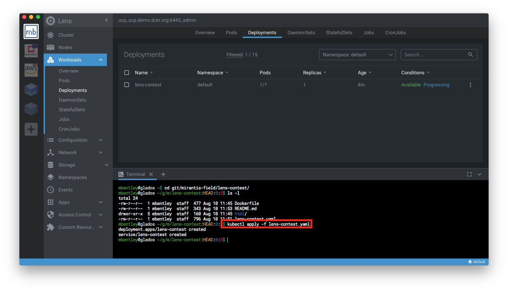
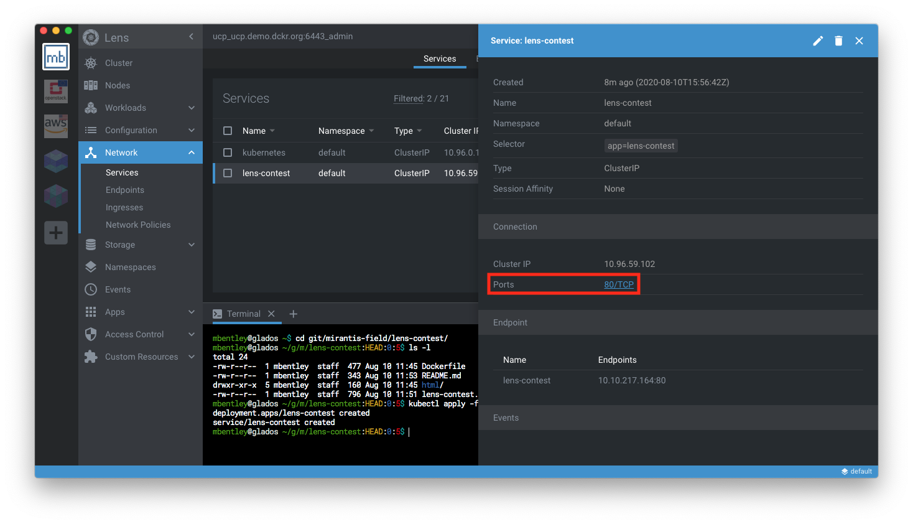

# Lens Contest

The Simple NGINX application for the Lens Contest is a fairly simple, static website running on NGINX to demonstrating NGINX in a Docker container.

## Deploying to Kubernetes

1. Using your Kubernetes distribution of choice, deploy the Lens demo application:

   ```
   $ kubectl apply -f lens-contest.yaml
   ```

   This will create a deployment and service for the Lens Contest application in the `default` Kubernetes namespace.  Feel free to override the namespace if you wish.

   

1. In Lens, navigate to `Network` > `Services` and find the `lens-contest` service object.

1. Click on the service to view the details and under the `Connection` section, fine the `Ports` and click on the link for `80/TCP` which will open your browser.

   

1. Check out the application and click on the button to enter the contest!
